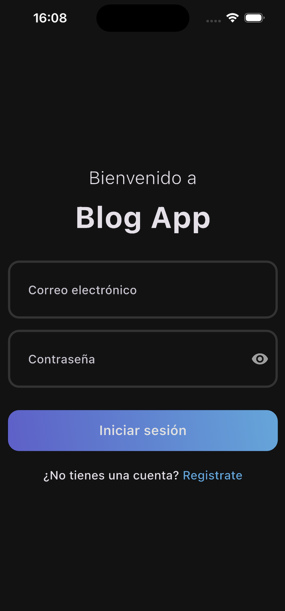
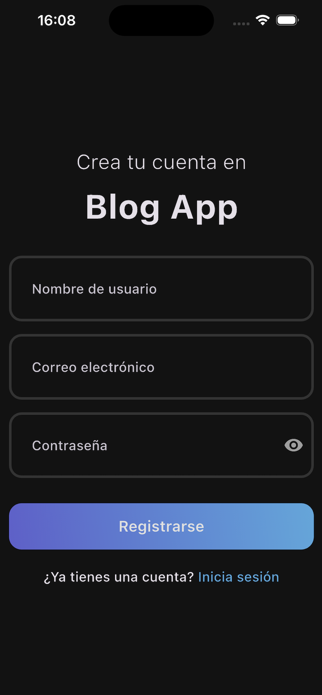
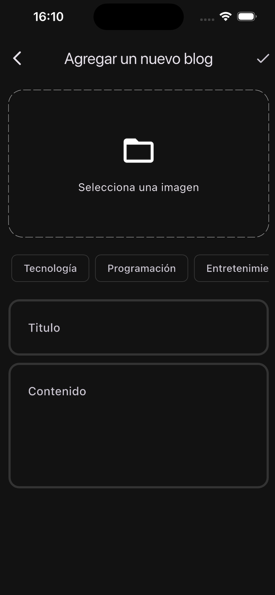
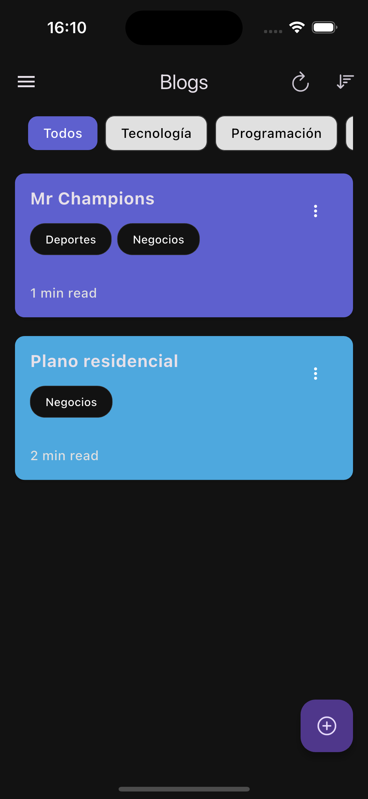

# 📱 BlogApp – Aplicación Flutter con Arquitectura Limpia


**BlogApp** es una aplicación móvil desarrollada con Flutter que permite la creación, visualización y gestión de publicaciones de blog. Implementa la arquitectura limpia, utilizando BLoC para la gestión de estado, Supabase como backend, y Hive/Isar para almacenamiento local.

---

## 🚀 Características Principales

- 📝 Creación, edición y eliminación de publicaciones de blog.
- 🔐 Autenticación de usuarios con Supabase.
- 🌐 Sincronización en tiempo real.
- 📷 Subida y recorte de imágenes con Image Picker e Image Cropper.
- 📱 Diseño responsive y moderno con animaciones.
- 💾 Almacenamiento local con Hive e Isar.
- 🧩 Arquitectura modular y escalable siguiendo principios de Clean Architecture.

---

## 📦 Dependencias Principales

| Paquete                         | Versión           | Descripción                         |
|---------------------------------|-------------------|-------------------------------------|
| `flutter_bloc`                  | ^9.0.0            | Gestión de estado con BLoC          |
| `supabase_flutter`              | ^2.8.3            | Backend como servicio               |
| `hive`                          | ^4.0.0-dev.2      | Almacenamiento local                |
| `isar_flutter_libs`             | ^4.0.0-dev.13     | Base de datos local                 |
| `image_picker`                  | ^1.1.2            | Selección de imágenes               |
| `image_cropper`                 | ^9.1.0            | Recorte de imágenes                 |
| `flutter_dotenv`                | ^5.2.1            | Manejo de variables de entorno      |
| `get_it`                        | ^8.0.3            | Inyección de dependencias           |
| `fpdart`                        | ^1.1.1            | Programación funcional              |
| `flutter_native_splash`         | ^2.4.4            | Pantalla de carga personalizada     |
| `flutter_staggered_animations`  | ^1.1.1            | Animaciones para listas             |
| `intl`                          | ^0.20.2           | Internacionalización                |
| `uuid`                          | ^4.5.1            | Generación de identificadores únicos|
| `internet_connection_checker_plus` | ^2.7.1         | Verificación de conexión a internet |

---

## 🛠️ Configuración

### Requisitos Previos

- Flutter SDK 3.5.3 o superior
- Dart SDK 3.5 o superior
- Cuenta en Supabase
- Android Studio o Xcode (para desarrollo nativo)

### Pasos de Instalación

1. **Clonar el repositorio:**

   ```bash
   git clone https://github.com/OdaFra/blogapp.git
   cd blogapp
    ```

2. **Instalar dependencias:**

   ```bash
    flutter pub get
    ```

3. **Configurar variables de entorno:**
    - Crea un archivo .env en la raíz del proyecto con el siguiente contenido:

   ```bash
    SUPABASE_URL=tu_url_supabase
    SUPABASE_ANON_KEY=tu_clave_anonima
    ```

4. **Generar la pantalla de carga personalizada:**

   ```bash
    flutter pub run flutter_native_splash:create
    ```

5. **Ejecutar la aplicación:**

   ```bash
    flutter run
    ```

## 🖼️ Vista previa

### 🔐 Login | 🆕 Registro | 📝 Crear blog

| Login | Registro | Crear blog |
|:-----:|:--------:|:----------:|
|  |  |  |

### 🏠 Pantalla principal | 👁️ Vista del blog

| Pantalla principal | Vista del blog |
|:------------------:|:--------------:|
|  |  |
